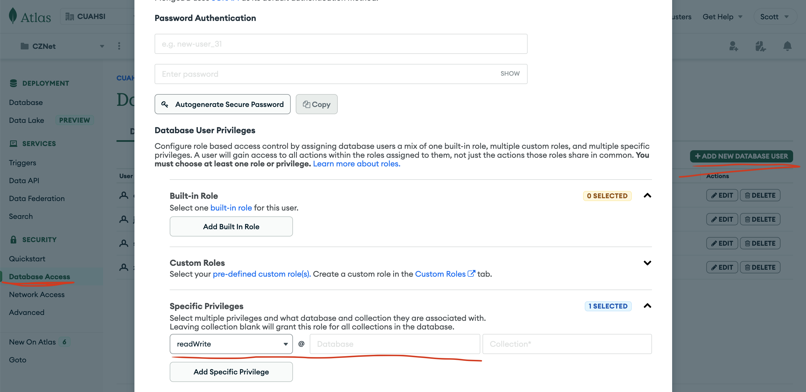
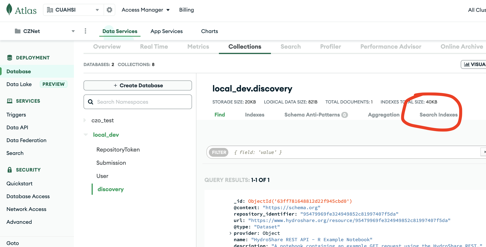

The submission portal API uses a mongodb docker image for convenience with local development.  Deployments do not use the docker image because it does not include search with lucene. In order to develop or run the discovery endpoints we use Atlas. There is a bit of manual configuration that must be done which is documented below.

### Overview
The CZNet project has 2 clusters, one for production and another for development and testing.

### Setup Database Access
Administrators should setup Database Access restricted to each Database.
1. In the left navigation column, select Database Access
2. Click ADD NEW DATABASE USER
3. Choose the authentication password Authentication Method
4. Scroll down to Database User Privileges -> Specific Privileges -> Add Specific Privilege
5. In the role dropdown select `readWrite`
6. In the Database text box include the database name
7. Click Add User

### Atlas Search Index Setup
1. Navigate to the cluster and select Search Indexes
2. Click Create Index
3. Select the JSON Editor Configuration Method
4. Click Next
5. Select the `discovery` collection under the new database
6. In the Index Name text box use `fuzzy_search`
7. Copy/Paste the contents of search_index.json into the json text box
8. Click Next
9. Click Create Search Index

